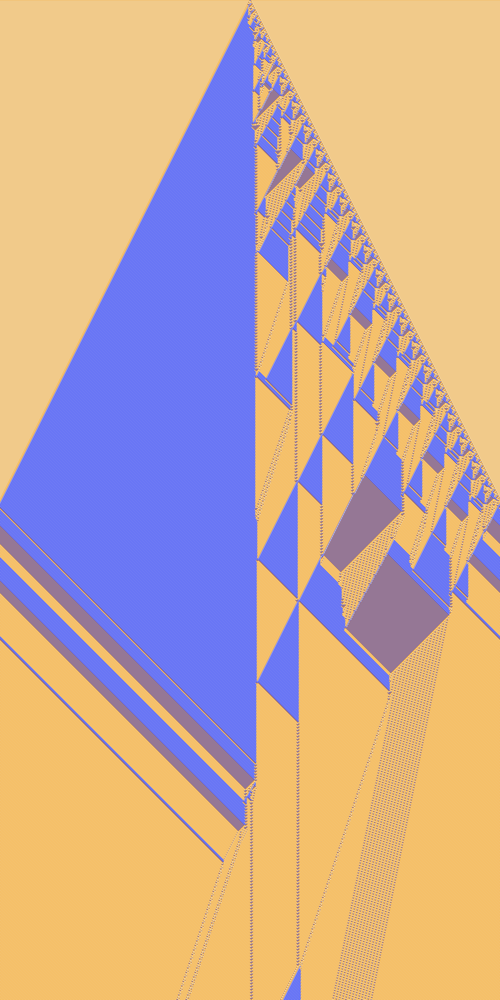
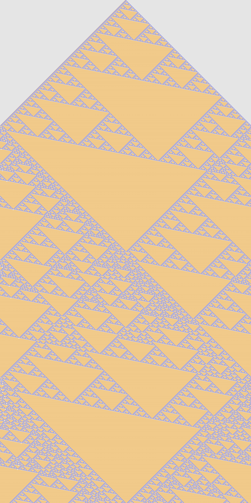
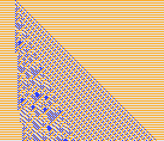
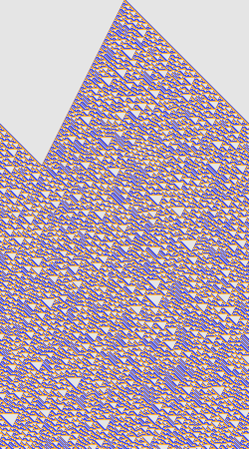

# yumm

### Run

Download [Processing](https://processing.org/download/?processing) (v2.2.1 verified works), open `yumm.pde`, and run.

Click on any of the 27 rules in the menu to the right to change the bottom output cell.

### About

[One-dimensional cellular automata](http://mathworld.wolfram.com/ElementaryCellularAutomaton.html) are neat.
The link describes the set of Elementary Cellular Automata, which have 2 states.
This tool lets you explore the entire space of 3 state one-dimensional cellular automata.

The **entire** space!  That's over 7.6 trillion possible rule combinations!  Though many of them are isometric.
Here are some pretty examples:

 

 

 

 

 

 

